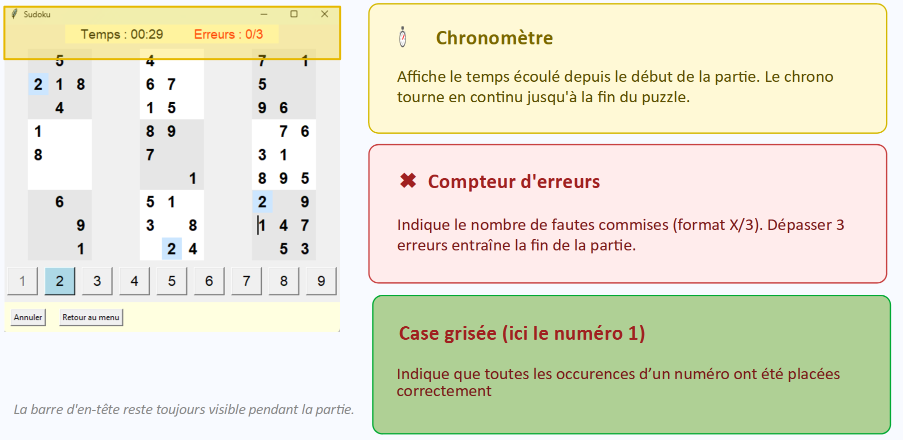
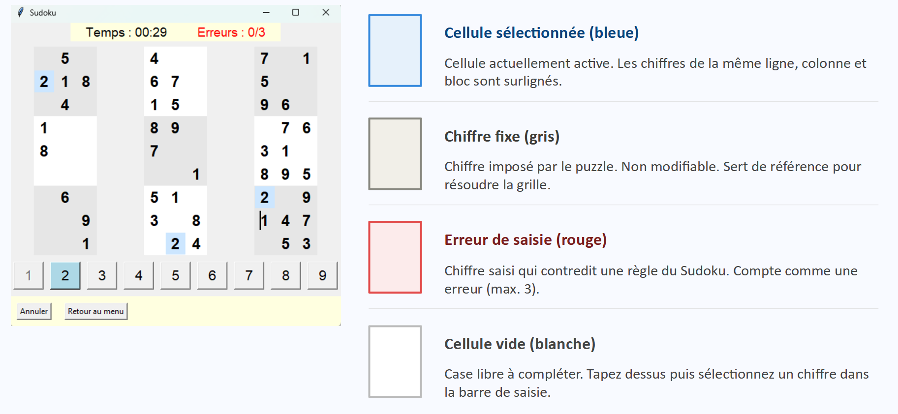
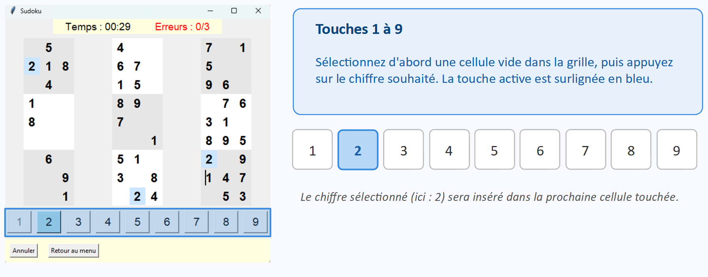
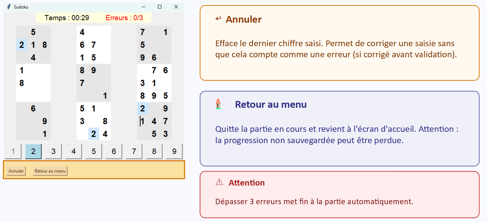

# projet-IN200
MITD-02
Elena Crisafulli, Amina Boualla, Lyna Mabrouk

# Exécution
`python main.py`

# Fichiers
- `main.py`: contient le lanceur de l'application et le menu d'accueil
- `interface.py`: les éléments graphiques du jeu en lui même et les fonctions associées
- `logique.py`: création d'une grille valide

# Comment jouer ?
## Ecran d'accueil
Choisir son niveau de difficulté :
   - Facile : 30 cases à remplir
   - Moyen : 40 cases à remplir
   - Difficile : 50 cases à remplir

## Interface principale

# Aide au joueur 

- Indice : permet de remplir automatiquement une case correcte de la grille (nombre limité d’indices)
- Croix (désélection de case) : si une case est déjà sélectionnée ou remplie, il faut d’abord la désélectionner en cliquant sur une autre case vide ou sur la croix (retour arrière) avant de pouvoir utiliser un indice sur une nouvelle case

  
  
